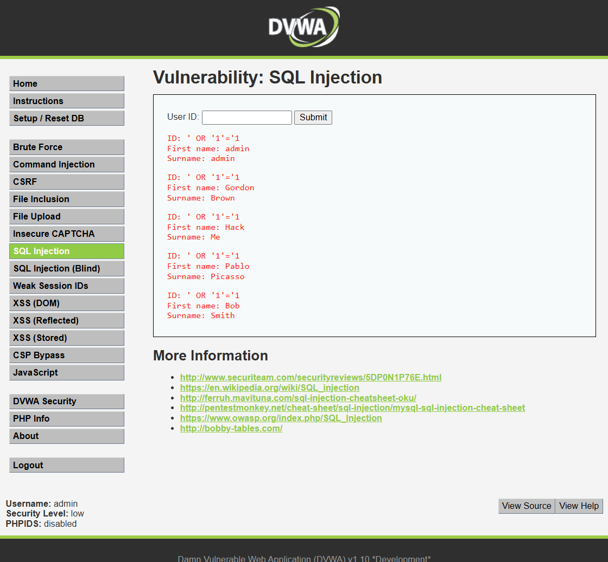

# Vulnerabilidad 01 — Inyección SQL (SQLi)

**Módulo DVWA:** SQL Injection  
**Nivel de seguridad:** Low  
**Categoría OWASP:** A03:2021 – Injection  

---

## 1. Evidencia del Ataque

### Payload utilizado

```
' OR '1'='1
```

### Procedimiento

1. Ingresar al módulo **SQL Injection** de DVWA
2. En el campo "User ID", introducir el payload: `' OR '1'='1`
3. Hacer clic en **Submit**
4. Observar que el sistema retorna **todos los registros** de la tabla de usuarios

### Captura de pantalla



> **Nota:** Reemplazar con la captura real obtenida de DVWA.

---

## 2. Explicación Técnica

### ¿Por qué funciona este ataque?

La consulta SQL original que ejecuta el servidor es:

```sql
SELECT first_name, last_name FROM users WHERE user_id = '$id';
```

Al inyectar `' OR '1'='1`, la consulta se transforma en:

```sql
SELECT first_name, last_name FROM users WHERE user_id = '' OR '1'='1';
```

La condición `OR '1'='1'` **siempre es verdadera**, por lo que la cláusula `WHERE` no filtra ningún registro y el servidor devuelve la tabla completa de usuarios.

### Causa raíz

El servidor concatena directamente la entrada del usuario en la cadena SQL **sin sanitización ni parametrización**. No existe validación del tipo de dato esperado (entero) ni escapado de caracteres especiales (`'`, `;`, `--`).

### Vectores de explotación avanzada

Con esta misma técnica base, un atacante puede:

| Técnica | Descripción |
|---|---|
| UNION-based | Extraer datos de otras tablas (recetas, fichas clínicas) |
| Error-based | Revelar la estructura de la base de datos |
| Blind SQLi | Extraer datos de forma silenciosa mediante consultas booleanas |
| Time-based | Confirmar vulnerabilidades usando retrasos de tiempo del servidor |
| Stacked queries | Ejecutar múltiples sentencias, incluyendo `DROP TABLE` o `INSERT` |

---

## 3. Puntuación CVSS 3.1

**Vector:** `CVSS:3.1/AV:N/AC:L/PR:N/UI:N/S:C/C:H/I:H/A:H`

| Métrica | Valor | Justificación |
|---|---|---|
| Attack Vector (AV) | Network (N) | El portal es accesible por Internet |
| Attack Complexity (AC) | Low (L) | El payload es trivial y no requiere condiciones especiales |
| Privileges Required (PR) | None (N) | No se requiere autenticación previa |
| User Interaction (UI) | None (N) | El atacante actúa solo, sin necesidad de engañar a otra persona |
| Scope (S) | Changed (C) | Afecta al servidor de base de datos, componente diferente al vulnerable |
| Confidentiality (C) | High (H) | Expone la totalidad de la base de datos de pacientes |
| Integrity (I) | High (H) | Permite modificar o eliminar registros clínicos |
| Availability (A) | High (H) | Permite eliminar tablas y tumbar la base de datos |

### **Puntuación Base: 10.0 — CRÍTICA**

---

## 4. Impacto Específico en SaludOnline

Un atacante que explote esta vulnerabilidad en el portal de SaludOnline podría:

- **Exfiltrar todas las fichas clínicas:** diagnósticos, enfermedades crónicas, medicamentos de pacientes
- **Robar credenciales de médicos y especialistas** para suplantar su identidad
- **Acceder a recetas médicas** y venderlas o utilizarlas para adquirir medicamentos controlados
- **Modificar diagnósticos o resultados de exámenes**, comprometiendo la seguridad clínica del paciente
- **Eliminar registros de atenciones**, generando problemas legales y médicos de trazabilidad
- Exponer **datos financieros y de seguros de salud** de todos los usuarios

Esto constituye una violación grave de la **Ley 19.628** con posibles consecuencias penales.

---

## 5. Política de Prevención

> **POL-SQL-01:** Todo acceso a la base de datos desde aplicaciones web deberá realizarse mediante consultas parametrizadas o procedimientos almacenados. Queda estrictamente prohibida la construcción dinámica de sentencias SQL mediante concatenación de cadenas con datos de entrada del usuario.

### Implementación técnica

**Consulta vulnerable (Python - ejemplo):**
```python
# INSEGURO - No usar
query = "SELECT * FROM users WHERE id = '" + user_id + "'"
cursor.execute(query)
```

**Consulta segura con parámetros:**
```python
# SEGURO - Usar prepared statement
query = "SELECT * FROM users WHERE id = %s"
cursor.execute(query, (user_id,))
```

**Uso de ORM (recomendado):**
```python
# SEGURO - SQLAlchemy / Django ORM
user = User.query.filter_by(id=user_id).first()
```

---

## 6. Control de Mitigación

Si la aplicación no puede ser parcheada de inmediato, aplicar los siguientes controles compensatorios:

| Control | Descripción | Efectividad |
|---|---|---|
| Web Application Firewall (WAF) | Detectar y bloquear patrones SQLi conocidos | Alta |
| Principio de mínimo privilegio | El usuario de DB solo debe tener permisos `SELECT` en tablas necesarias | Alta |
| Monitoreo de consultas | Alertar ante consultas que retornen más de N registros inesperadamente | Media |
| Cifrado de datos sensibles en DB | Las fichas clínicas deben estar cifradas en reposo | Media |
| Rate limiting | Limitar la cantidad de solicitudes por IP y usuario | Baja |

---

## 7. Plan de Recuperación ante Incidente

Si se detecta una explotación activa de SQLi:

1. **Contener (0-1h):** Desconectar el servidor de base de datos de Internet; activar modo mantenimiento
2. **Evaluar (1-4h):** Revisar logs del servidor web y de base de datos para determinar qué datos fueron accedidos o modificados
3. **Notificar (4-24h):** Comunicar el incidente a la autoridad competente (CSIRT de Gobierno) y notificar a los afectados según Ley 19.628
4. **Restaurar (24-72h):** Restaurar desde el último backup íntegro y aplicar parche de prepared statements
5. **Post-incidente:** Realizar auditoría forense completa y contratar prueba de penetración externa
